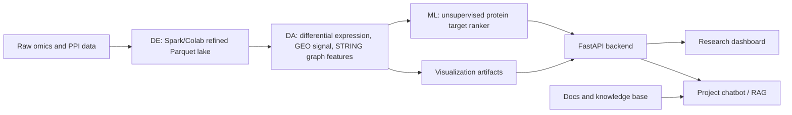

# LUAD Protein Target Atlas

**Big Data Analytics for Drug Target Identification using multi-omics expression data and STRING protein-protein interaction networks.**

This repository implements an end-to-end research platform for prioritizing candidate protein targets associated with lung adenocarcinoma (TCGA-LUAD). It integrates TCGA/GDC expression data, GEO validation signals, STRING PPI network evidence, data analysis outputs, unsupervised ML target ranking, FastAPI serving, an interactive research dashboard, and a Gemini-backed project chatbot.

> Scientific scope: this project ranks **candidate protein targets for further study**. It does not claim causal cancer drivers, validated therapies, clinical diagnosis, or treatment recommendations.

---

## Table of Contents

- [Project Objective](#project-objective)
- [What This Platform Does](#what-this-platform-does)
- [Architecture](#architecture)
- [Repository Structure](#repository-structure)
- [Core Data Artifacts](#core-data-artifacts)
- [Machine Learning Design](#machine-learning-design)
- [Dashboard Features](#dashboard-features)
- [Chatbot / RAG](#chatbot--rag)
- [Requirements](#requirements)
- [Environment Setup](#environment-setup)
- [Run Locally](#run-locally)
- [Run the Colab Pipelines](#run-the-colab-pipelines)
- [Distributed Spark/HDFS Package](#distributed-sparkhdfs-package)
- [API Reference](#api-reference)
- [Documentation Files](#documentation-files)
- [Scientific Interpretation](#scientific-interpretation)
- [Limitations](#limitations)
- [Troubleshooting](#troubleshooting)
- [Security Notes](#security-notes)

---

## Project Objective

The original Big Data assignment asks for a system that:

- integrates gene expression datasets,
- processes large gene/protein datasets using distributed computing,
- applies clustering and statistical analysis,
- identifies candidate drug targets associated with disease,
- visualizes biological interaction networks,
- uses GEO, STRING, and TCGA datasets.

This project addresses that requirement by building a platform that ranks **candidate protein targets inferred from protein-coding genes** in LUAD.

Expression data is gene-level, but the drug-discovery entity is the encoded protein product. For example:

```text
PLK1 gene -> Polo-like kinase 1 protein target
TOP2A gene -> DNA topoisomerase II alpha protein target
SPP1 gene -> Osteopontin protein target
```

---

## What This Platform Does

The platform combines multiple evidence layers:

| Evidence Layer | Purpose |
|---|---|
| TCGA/GDC expression | Tumor-vs-normal differential expression evidence |
| GEO validation | Independent stage-associated validation signal |
| STRING PPI | Protein-protein interaction network context |
| Statistical analysis | log2FC, p-value, FDR, -log10(FDR), prevalence |
| Network analysis | degree, weighted degree, PageRank, betweenness |
| Unsupervised ML | candidate protein target prioritization |
| Auxiliary classifier | tumor-like expression evidence only |
| Dashboard | interactive target exploration and network visualization |
| Chatbot | project-grounded Q&A over knowledge base and artifact evidence |

---

## Architecture



Runtime layers:

```text
Data Engineering     -> notebooks/DE_onColab.ipynb
Data Analysis + ML   -> notebooks/DA&ML_onColab.ipynb
Cluster-ready design -> cluster/ + src/distributed/
Backend API          -> src/backend/
Frontend dashboard   -> src/frontend/
RAG knowledge base   -> docs/project_knowledge_base.md
```

---

## Repository Structure

```text
drug_target_project/
├── cluster/                    # 5-node Spark/HDFS execution design and submit scripts
│   ├── 5node/
│   ├── hdfs/
│   ├── spark/
│   └── run_evidence/
├── config/                     # optional labels/config artifacts
├── data/
│   ├── raw/                    # raw data zone, usually not committed
│   └── refined/                # refined Parquet artifacts from DE
├── docs/                       # project docs, RAG knowledge base
├── notebooks/
│   ├── DE_onColab.ipynb        # Colab Data Engineering pipeline
│   └── DA&ML_onColab.ipynb     # Colab Data Analysis + ML pipeline
├── outputs/                    # DA/ML artifacts consumed by backend/dashboard
├── scripts/                    # helper scripts for generated documentation
├── src/
│   ├── ai_model/               # optional local model storage
│   ├── backend/                # FastAPI backend
│   ├── distributed/            # Spark/HDFS cluster-ready entrypoints
│   └── frontend/               # static research dashboard
├── .env.example
├── requirements.txt
└── README.md
```

---

## Core Data Artifacts

The backend expects refined and output artifacts to exist locally.

### Refined Data

Generated by the DE phase:

```text
data/refined/gdc/annotate.parquet
data/refined/geo/annotate.parquet
data/refined/STRING/nodes_gene.parquet
data/refined/STRING/edges_gene.parquet
```

### DA / Visualization Outputs

Generated by the DA phase:

```text
outputs/master_biomarker_features.parquet
outputs/top_drug_targets.csv
outputs/volcano_points.parquet
outputs/heatmap_matrix.parquet
outputs/network_subgraph.json
outputs/da_run_summary.json
```

### ML Outputs

Generated by the ML phase:

```text
outputs/ml_inputs/
outputs/ml_models/best_tumor_normal_model_strict.joblib
outputs/ml_models/best_model_metrics.json
outputs/ml_models/best_model_feature_importance_joined.parquet
outputs/ml_models/protein_target_ranker.joblib
outputs/ml_models/protein_target_ranking.parquet
outputs/ml_models/protein_target_ranker_summary.json
```

### Biological Evidence Outputs

Optional but recommended:

```text
outputs/biological_evidence/target_evidence_enriched.parquet
outputs/biological_evidence/pathway_enrichment_top100.csv
outputs/biological_evidence/gene_reports.json
outputs/biological_evidence/biological_evidence_summary.json
```

If some biological evidence files are missing, the backend has fallback logic based on target score, GEO validation, STRING PPI features, auxiliary model importance, and protein ML ranking.

---

## Machine Learning Design

The project separates the main target-discovery model from a supporting phenotype classifier.

### Primary Model: Unsupervised Protein Target Ranker

Main project model.

Purpose:

```text
Rank candidate protein targets for LUAD.
```

Why unsupervised?

The project does not have reliable labels such as:

```text
true drug target
not a drug target
```

Therefore, the main model prioritizes targets using evidence profiles instead of supervised labels.

Algorithms:

- Isolation Forest priority
- Gaussian Mixture rarity
- KMeans target clustering
- biological evidence prior

Outputs:

```text
protein_ml_priority_score
protein_ml_rank
protein_target_cluster
```

### Supporting Model: Tumor-like Expression Classifier

Secondary model only.

Purpose:

```text
Given a gene expression profile, estimate whether it looks tumor-like or normal-like.
```

Best model:

```text
Logistic Regression L2
```

This classifier supports feature contribution analysis and phenotype evidence. It is **not** the main drug target discovery model and is **not** a clinical diagnostic model.

---

## Dashboard Features

The frontend is a static research dashboard served by FastAPI.

Main views:

- **Overview**: KPI cards and research insight summary.
- **Data Fabric**: Big Data system flow from TCGA/GDC, GEO, STRING to serving layer.
- **Target Prioritization**: searchable/filterable candidate protein target table.
- **Volcano Landscape**: differential expression plot with zoom, pan, fullscreen, and click drill-down.
- **Functional Enrichment**: biological programs enriched among top targets.
- **Integrated Evidence**: stacked evidence decomposition per target.
- **Top-target Heatmap**: expression patterns across samples.
- **STRING PPI Network**: protein-protein interaction subgraph.
- **Compare Board**: side-by-side protein target comparison.
- **Model Evidence**: primary ranker and auxiliary classifier evidence cards.
- **Expression Probe**: secondary model inference from pasted expression profile.
- **Chatbot**: project-grounded Q&A.
- **Docs**: in-app documentation for metrics and interpretation.

Interaction features:

- selected target cross-filtering,
- target evidence drawer,
- command palette,
- chart zoom/pan/fullscreen,
- contextual chatbot prompts,
- tooltip explanations for key metrics,
- loading and empty states.

---

## Chatbot / RAG

The chatbot is backed by:

- project Markdown knowledge base,
- optional Gemini generation,
- Google embedding model for retrieval,
- prompt-injection guardrails,
- live artifact grounding for mentioned targets.

Knowledge base:

```text
docs/project_knowledge_base.md
```

Default model config:

```text
GEMINI_MODEL=gemini-2.5-flash
GEMINI_EMBEDDING_MODEL=gemini-embedding-001
```

If Gemini is unavailable or no API key is provided, the backend falls back to local retrieval/artifact summaries.

Example chatbot question:

```text
Why is PLK1 prioritized as a candidate protein target in this project?
```

---

## Requirements

Recommended local environment:

- Python 3.10 or 3.11
- pip
- Windows PowerShell, macOS shell, or Linux shell
- optional MongoDB local instance
- optional Gemini API key

Python packages are listed in:

```text
requirements.txt
```

Core dependencies:

- FastAPI
- Uvicorn
- pandas
- numpy
- pyarrow
- scikit-learn
- joblib
- networkx
- pymongo
- google-genai

---

## Environment Setup

### 1. Clone the repository

```bash
git clone <your-repo-url>
cd drug_target_project
```

### 2. Create a virtual environment

Windows PowerShell:

```powershell
python -m venv .venv
.\.venv\Scripts\Activate.ps1
```

macOS/Linux:

```bash
python -m venv .venv
source .venv/bin/activate
```

### 3. Install dependencies

```bash
pip install -r requirements.txt
```

### 4. Create `.env`

Copy:

```text
.env.example -> .env
```

Windows:

```powershell
Copy-Item .env.example .env
```

macOS/Linux:

```bash
cp .env.example .env
```

Then edit `.env` for your local paths and optional API keys.

At minimum, verify:

```text
OUTPUTS_DIR=...
REFINED_DIR=...
RAG_KNOWLEDGE_BASE_PATH=...
RAG_INDEX_PATH=...
```

Optional Gemini:

```text
RAG_MODE=gemini
GEMINI_API_KEY=your_key_here
GEMINI_MODEL=gemini-2.5-flash
GEMINI_EMBEDDING_MODEL=gemini-embedding-001
```

Optional MongoDB:

```text
MONGODB_ENABLED=true
MONGODB_URI=mongodb://localhost:27017
MONGODB_DB=drugtarget_luad
```

The app can run without MongoDB.

---

## Run Locally

Start the FastAPI app:

```bash
uvicorn src.backend.app:app --host 127.0.0.1 --port 8000 --reload
```

Open:

```text
http://127.0.0.1:8000
```

API docs:

```text
http://127.0.0.1:8000/docs
```

Project docs page:

```text
http://127.0.0.1:8000/docs-page
```

Health check:

```bash
curl http://127.0.0.1:8000/api/health
```

Windows PowerShell:

```powershell
Invoke-WebRequest http://127.0.0.1:8000/api/health -UseBasicParsing
```

---

## Run the Colab Pipelines

The canonical executed data pipelines are stored as Colab notebooks:

```text
notebooks/DE_onColab.ipynb
notebooks/DA&ML_onColab.ipynb
```

Recommended execution order:

1. Run `DE_onColab.ipynb`
   - Builds refined Parquet data.
   - Produces GDC, GEO, and STRING refined artifacts.

2. Run `DA&ML_onColab.ipynb`
   - Builds DA evidence artifacts.
   - Builds ML input matrices.
   - Trains auxiliary expression classifier.
   - Trains unsupervised protein target ranker.
   - Produces outputs consumed by backend/dashboard.

After Colab execution, copy/download the generated refined and output folders into the local repo:

```text
data/refined/
outputs/
```

---

## Distributed Spark/HDFS Package

The repository includes a cluster-ready package for a 5-node Spark/HDFS environment.

```text
cluster/
src/distributed/
docs/distributed_bigdata_execution_design.md
```

Target topology:

- 1 master node
- 4 worker nodes
- HDFS NameNode/DataNodes
- YARN ResourceManager/NodeManagers
- Spark executors
- Spark History Server

Initialize HDFS layout:

```bash
bash cluster/hdfs/bootstrap_hdfs_layout.sh
```

Submit DE:

```bash
bash cluster/spark/submit_de.sh
```

Submit DA/ML:

```bash
bash cluster/spark/submit_da_ml.sh
```

Run evidence folder:

```text
cluster/run_evidence/
```

Important: this folder is for real Spark/YARN/HDFS logs after a physical cluster run. Do not add fabricated logs.

Honest project statement:

> The project was developed and validated with Colab notebooks over refined Parquet artifacts. The repository also includes a Spark/HDFS 5-node execution design, submit scripts, HDFS layout, and Spark entrypoints mapping the same DE and DA/ML stages to a distributed environment.

---

## API Reference

Main endpoints:

| Endpoint | Purpose |
|---|---|
| `GET /api/health` | Backend, model, MongoDB, and RAG status |
| `GET /api/project` | Project overview and data-source summary |
| `GET /api/model` | Primary ranker and auxiliary classifier metadata |
| `GET /api/targets` | Ranked candidate protein targets |
| `GET /api/targets/enriched` | Integrated target evidence |
| `GET /api/enrichment` | Functional enrichment summary |
| `GET /api/volcano` | Volcano plot data |
| `GET /api/heatmap` | Heatmap matrix |
| `GET /api/network` | STRING PPI network subgraph |
| `GET /api/feature-importance` | Auxiliary classifier features |
| `GET /api/gene/{gene}` | Protein target evidence JSON |
| `GET /api/gene/{gene}/report` | HTML evidence report |
| `GET /api/compare?genes=PLK1,AURKB` | Compare targets |
| `POST /api/predict` | Auxiliary tumor-like expression probe |
| `POST /api/chat` | Project chatbot |

Example:

```bash
curl "http://127.0.0.1:8000/api/targets?limit=5"
```

Prediction payload:

```json
{
  "input_scale": "log2_tpm",
  "top_k": 12,
  "expression": {
    "TP53": 18.2,
    "SPP1": 120.4,
    "PLK1": 12.0
  }
}
```

Chat payload:

```json
{
  "question": "Why is PLK1 prioritized as a candidate protein target?",
  "limit": 4
}
```

---

## Documentation Files

Important docs:

```text
docs/project_knowledge_base.md
docs/distributed_bigdata_execution_design.md
docs/DA_Giai_Phap_Va_Dac_Trung_Trich_Xuat.docx
docs/ML_Giai_Phap_Va_Dac_Ta_Model.docx
docs/Visualization_Giai_Phap_Dashboard.docx
```

Generated Word specs are intended for team communication and project reporting.

---

## Scientific Interpretation

Correct language:

```text
PLK1 is a high-priority candidate protein target associated with LUAD based on expression dysregulation, GEO validation, STRING PPI context, and target ranking evidence.
```

Avoid unsupported claims:

```text
PLK1 causes lung cancer.
PLK1 is a clinically validated therapeutic target.
The model discovered a proven anti-cancer drug.
The classifier is a clinical diagnostic system.
```

Interpretation rules:

- Say **candidate protein target**.
- Say **associated with LUAD** or **prioritized for further study**.
- Do not claim causality.
- Do not claim clinical validation.
- Do not claim treatment efficacy.
- Keep the primary model and auxiliary classifier roles separate.

---

## Limitations

Important scientific and technical limitations:

- GEO is used as stage-associated validation, not strict external tumor-vs-normal validation.
- Protein targets are inferred from protein-coding gene expression, not direct proteomics measurements.
- Survival evidence is exploratory because refined clinical event/censoring metadata is limited.
- Druggability annotations are local/curated and not a full DrugBank/Open Targets integration.
- The primary target ranker is unsupervised because true drug-target labels are unavailable.
- The auxiliary classifier has high metrics but is affected by class imbalance and is not a clinical diagnostic model.
- The dashboard is for research prioritization and educational demonstration.

---

## Troubleshooting

### `ModuleNotFoundError`

Install dependencies:

```bash
pip install -r requirements.txt
```

### Missing artifacts

If the backend returns 503 or tables are empty, verify:

```text
data/refined/
outputs/
outputs/ml_models/
```

Run the Colab notebooks and copy outputs back into the repo.

### Chatbot uses local fallback

If Gemini is unavailable:

- check `GEMINI_API_KEY`,
- check `RAG_MODE=gemini`,
- install `google-genai`,
- restart backend.

The app still works in local retrieval mode.

### Browser does not show latest UI

Hard refresh:

```text
Ctrl + F5
```

or restart the FastAPI server.

### MongoDB connection fails

MongoDB is optional. Set:

```text
MONGODB_ENABLED=false
```

unless you want event logging.

---

## Security Notes

- Do not commit `.env`.
- Do not commit API keys.
- Do not commit private credentials.
- Use `.env.example` as the public template.
- The chatbot includes prompt-injection checks and treats retrieved chunks as untrusted context.
- Real cluster logs should go under `cluster/run_evidence/` only after actual execution.

---

## Suggested GitHub Hygiene

For a public repository, consider excluding large generated data:

```text
data/raw/
data/refined/
outputs/
.venv/
*.log
```

If you need to share artifacts, use one of:

- Git LFS,
- release assets,
- cloud storage link,
- Hugging Face dataset,
- institutional storage.

---

## Status

Current implemented components:

- Data Engineering Colab notebook
- Data Analysis + ML Colab notebook
- FastAPI backend
- static research dashboard
- primary unsupervised protein target ranker support
- auxiliary expression classifier support
- target evidence report endpoints
- project chatbot / RAG
- in-app docs page
- Spark/HDFS 5-node cluster-ready package

